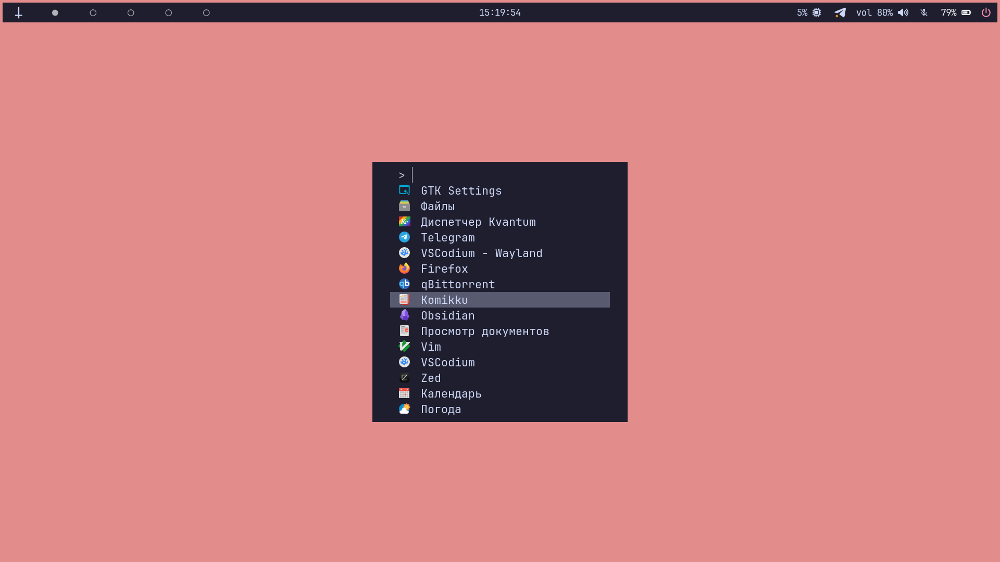
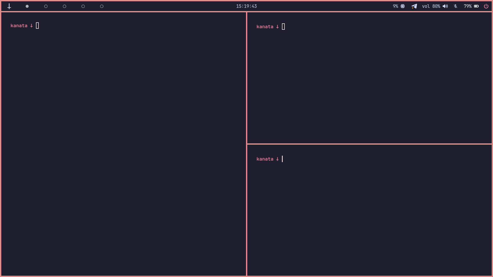
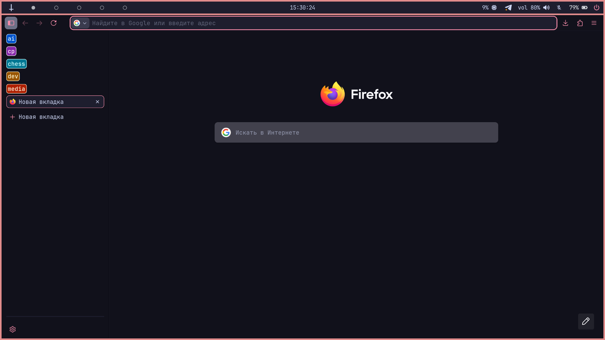

# 📸 Gallery




# ℹ️ Installation
```sh
# I assume that the commands are executed on a fresh Arch Linux 
# installation with a standard Linux kernel and Intel iGPU. 

sudo pacman -Syu hyprland hyprshot hyprpaper hyprsunset hyprpolkitagent \
xdg-desktop-portal-hyprland hyprpicker fuzzel waybar firefox cliphist   \
telegram-desktop kvantum amberol vim git curl htop btop gnome-calendar  \
gnome-calculator gnome-weather yazi kitty helix imv mpv nushell uv      \
gobject-introspection gtk-layer-shell gcc llvm lldb clang meson ninja   \
micro fastfetch xdg-user-dirs nwg-look github-cli zsh mesa              \
intel-media-driver vulkan-intel obsidian helix wget curl eza            \
ttf-jetbrains-mono-nerd

LC_ALL=C xdg-user-dirs-update

chsh -s /bin/zsh
sh -c "$(curl -fsSL https://raw.githubusercontent.com/ohmyzsh/ohmyzsh/master/tools/install.sh)"

git clone https://github.com/ArtsyMacaw/wlogout
cd wlogout
meson build
ninja -C build
sudo ninja -C build install
cd .. && rm -rf wlogout

mkdir ~/Pictures/Wallpapers

git clone https://github.com/nightmarescult/Dotfiles 
cd Dotfiles
cp -r Dotfiles/.config/* ~/.config
cp -r Dotfiles/.themes ~
cp -r Dotfiles/.icons ~
cp Dotfiles/.zshrc ~
cp Dotfiles/.zshenv ~

cp Dotfiles/assets/wallpaper.png ~/Pictures/Wallpapers
systemctl reboot
```

# 🎁 Post installation
You may want to hide some less useful applications from fuzzel. You can do this as follows:

```sh
sudo -i
echo -e "Hidden=true\nNoDisplay=true" >> /usr/share/applications/avahi-discover.desktop
echo -e "Hidden=true\nNoDisplay=true" >> /usr/share/applications/bssh.desktop
echo -e "Hidden=true\nNoDisplay=true" >> /usr/share/applications/bvnc.desktop
echo -e "Hidden=true\nNoDisplay=true" >> /usr/share/applications/btop.desktop
echo -e "Hidden=true\nNoDisplay=true" >> /usr/share/applications/electron37.desktop
echo -e "Hidden=true\nNoDisplay=true" >> /usr/share/applications/xgpsspeed.desktop
echo -e "Hidden=true\nNoDisplay=true" >> /usr/share/applications/xgps.desktop
echo -e "Hidden=true\nNoDisplay=true" >> /usr/share/applications/qv4l2.desktop
echo -e "Hidden=true\nNoDisplay=true" >> /usr/share/applications/qvidcap.desktop
echo -e "Hidden=true\nNoDisplay=true" >> /usr/share/applications/htop.desktop
```

